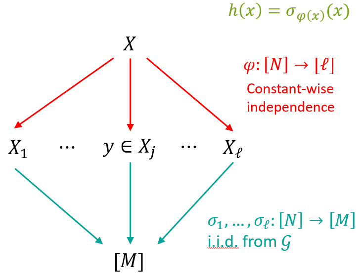
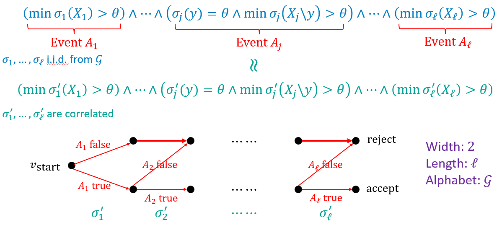

## **SODA’2026 | 具有最优大小 min-wise 哈希族的显式构造**

<strong>导读：</strong>本期推文解读的是 SODA 2026 的论文 Explicit Min-wise Hash Families with Optimal Size。作者为中国科学技术大学的特任教授陈雪，本科生黄盛唐，与 Johns Hopkins 大学的副教授李昕（按照姓氏首字母排序）。

该工作提供了 min-wise 哈希家族的新显式构造，首次在保持哈希家族的大小为多项式级别，即种子长度是最优 $O(\log N)$ 时，获得了亚常数的乘法误差。该构造融合了伪随机理论的多个技术，提出一类具有特殊性质的随机提取器（randomness extractor），以此来满足 min-wise 哈希家族需要的乘法误差。该构造还可以向 $k$-min-wise 哈希家族扩展。

<strong>论文全文：</strong>https://arxiv.org/abs/2510.10431

### **问题背景**

海量数据的处理、搜索引擎以及流算法经常面临一个基础问题：如何高效地从一些元素中以公平的概率选出一个代表元素？或者更进一步，如何判断两个巨大的集合有多相似？Min-wise 哈希正是解决这类问题的利器。

更具体，考虑 $[N] \to [M]$ 映射的哈希函数家族 $\mathcal{H}$，如果对于 $[N]$ 的任意给定子集 $X$ 和其中的任意元素 $y$，$\mathcal{H}$ 能保证其随机的哈希函数 $h(y)$ 是集合 $X$ 中严格最小值的概率近似为 $1/|X|$，哈希家族 $\mathcal{H}$ 就满足 min-wise。用公式表示，即要求其满足：
$$
\Pr_{h \sim \mathcal{H}} \left[ h(y) < \min_{x \in X \setminus y} h(x) \right] = \frac{1 \pm \delta}{|X|},
$$

其中 $\delta$ 表示乘法误差 [1, 4, 7]。这相当于要求哈希函数族模拟了一个随机排列，使得每个元素都有均等的机会成为最小值。

Min-wise 哈希在计算机科学中有着极其广泛的应用，以下是几个经典场景：
- Jaccard 相似度估计 [2]：这是 min-wise 最著名的应用。对于两个集合 $A$ 和 $B$，它们的 Jaccard 相似度定义为 $|A \cap B| / |A \cup B|$。通过 min-wise 哈希，我们可以证明：两个集合拥有相同最小哈希值的概率，恰好等于它们的 Jaccard 相似度，这使得我们可以快速地估算相似度。
- 网页去重与文档查重 [6]：搜索引擎利用上述原理在抓取亿级网页时，快速识别内容高度相似的近似重复网页，从而节省存储空间并提升搜索质量。
- 流算法与 $\ell_0$ 采样 [3]：在数据流模型中，我们无法存储所有数据。Min-wise 哈希被用于构造 $\ell_0$ 采样器（$\ell_0$-sampler），即从动态变化的数据流中均匀随机地抽取不同的元素，这对于网络流量监控和数据库查询优化等应用至关重要。

进一步地，$k$-min-wise 哈希是该概念的推广，要求对于任意大小为 $k$ 的子集 $Y$，其所有元素的哈希值都小于集合中剩余元素的概率近似为 $1/\binom{|X|}{|Y|}$。这在需要更高阶独立性的复杂图算法中非常有用。

### **挑战与贡献**

本文关注的问题是优化 min-wise 哈希族的种子长度，即如何用尽可能少的随机比特（也称作种子长度 seed length），来实现尽可能小的误差。种子长度直接决定了算法的空间复杂度。

理论上，我们知道存在种子长度仅为 $O(\log N)$ 的 min-wise 哈希族，但在本工作之前，并没有显式的构造能同时达到最优种子长度和低误差。

此前的研究给出的构造主要有两类：
- 基于 $t$-wise 独立哈希 [4, 7]：种子长度为 $O(\log (1 / \delta) \log N)$。当误差 $\delta$ 是亚常数时，种子长度都超过 $O(\log N)$。
- 基于伪随机生成器（PRG）的方法 [5, 9]：将 min-wise 哈希转化为组合矩形（combinatorial rectangles）的伪随机生成器问题。目前最好的结果做到了 $O(\log N \log \log N)$ 的种子长度。

在本文中，我们填补了这一理论空白，给出了第一个**显式**的构造，具有最优种子长度 $O(\log N)$（对于 $k$-min-wise 为 $O(k \log N)$），与低至 $2^{-O\left( \frac{\log N}{\log \log N} \right)}$ 的亚常数乘法误差。

这一结果在理论上证明了通过显式构造可以逼近非显式存在的下界，在应用上则意味着可以使用更少的空间来实现高精度的相似度估算和采样。

### **技术梗概**

我们的构造主要包含三个关键步骤：

1. 分桶：我们首先利用简单的哈希函数将大集合随机分配到多个小的“桶”中。由于每个桶内的元素数量较少，我们可以用较小的代价在每个桶内进行处理，从而简化问题规模。

2. 随机性复用：为了避免对每个桶都使用独立种子带来的巨大空间开销，我们使用 Nisan-Zuckerman 框架 [8]。它允许我们通过少量种子生成大量高质量的伪随机串，分配给不同的桶使用，从而实现随机性的高效复用。

3. 消除关键误差：Min-wise 哈希对误差极其敏感，传统的伪随机方法往往会引入微小的加法误差，而在概率极小的情况下，这种误差会被灾难性地放大。为了解决这一问题，我们创新性地调整了计算顺序，优先处理包含目标元素的“关键桶”，并配合一种特殊的随机性提取器（randomness extractor）。这确保了在最关键的步骤上实现零误差，从而在保持低种子长度的同时，实现整体的低误差。

### **总结展望**

这项工作首次给出了 min-wise 哈希族具有最优种子长度与亚常数乘法误差的显式构造，并探索了经典的 Nisan-Zuckerman PRG 和随机提取器（randomness extractor）的扩展与应用。

有关 min-wise 哈希，仍有许多有趣的开放问题值得探索。在种子长度方面，终极目标是同时达到 $O(\log N)$ 的种子长度和多项式小的乘法误差。另一方面，这项工作对哈希函数族的另一重要指标 —— 计算时间 —— 只做了最基本的要求。是否有可能在保持种子长度和乘法误差的同时，加速计算时间，也是一个值得思考的问题。在其他哈希族的设计，甚至更广阔的算法设计领域中，我们也期待本文使用的 Nisan-Zuckerman 框架与特殊随机性提取器可以被后续研究运用到各式各样问题的设计与分析上。

<strong>撰稿人介绍：</strong>黄盛唐，中国科学技术大学少年班学院本科生，导师为陈雪特任教授，主要研究领域为理论计算机科学。

### 参考文献

[1] Andrei Z Broder, Moses Charikar, Alan M Frieze, and Michael Mitzenmacher. Min-wise independent permutations. Journal of Computer and System Sciences, 60(3):630–659, 2000.

[2] Edith Cohen, Mayur Datar, Shinji Fujiwara, Aristides Gionis, Piotr Indyk, Rajeev Motwani, Jeffrey D. Ullman, and Cheng Yang. Finding interesting associations without support pruning. IEEE Trans. on Knowl. and Data Eng., 13(1):64–78, January 2001.

[3] Graham Cormode and Donatella Firmani. A unifying framework for $\ell_0$-sampling algorithms. Distrib Parallel Databases, 32:315–335, January 2014.

[4] Guy Feigenblat, Ely Porat, and Ariel Shiftan. Exponential time improvement for min-wise based algorithms. Inf. Comput., 209(4):737–747, April 2011.

[5] Parikshit Gopalan and Amir Yehudayoff. Concentration for limited independence via inequalities for the elementary symmetric polynomials. Theory of Computing, 16(17):1-29, 2020.

[6] Monika Henzinger. Finding near-duplicate web pages: a large-scale evaluation of algorithms. In Proceedings of the 29th Annual International ACM SIGIR Conference on Research and Development in Information Retrieval, SIGIR ’06, page 284–291, New York, NY, USA, 2006. Association for Computing Machinery.

[7] Piotr Indyk. A small approximately min-wise independent family of hash functions. J. Algorithms, 38(1):84–90, January 2001.

[8] Noam Nisan and David Zuckerman. Randomness is linear in space. J. Comput. Syst. Sci., 52(1):43–52, 1996.

[9] Michael Saks, Aravind Srinivasan, Shiyu Zhou, and David Zuckerman. Low discrepancy sets yield approximate min-wise independent permutation families. Inf. Process. Lett., 73(1–2):29–32, January 2000.